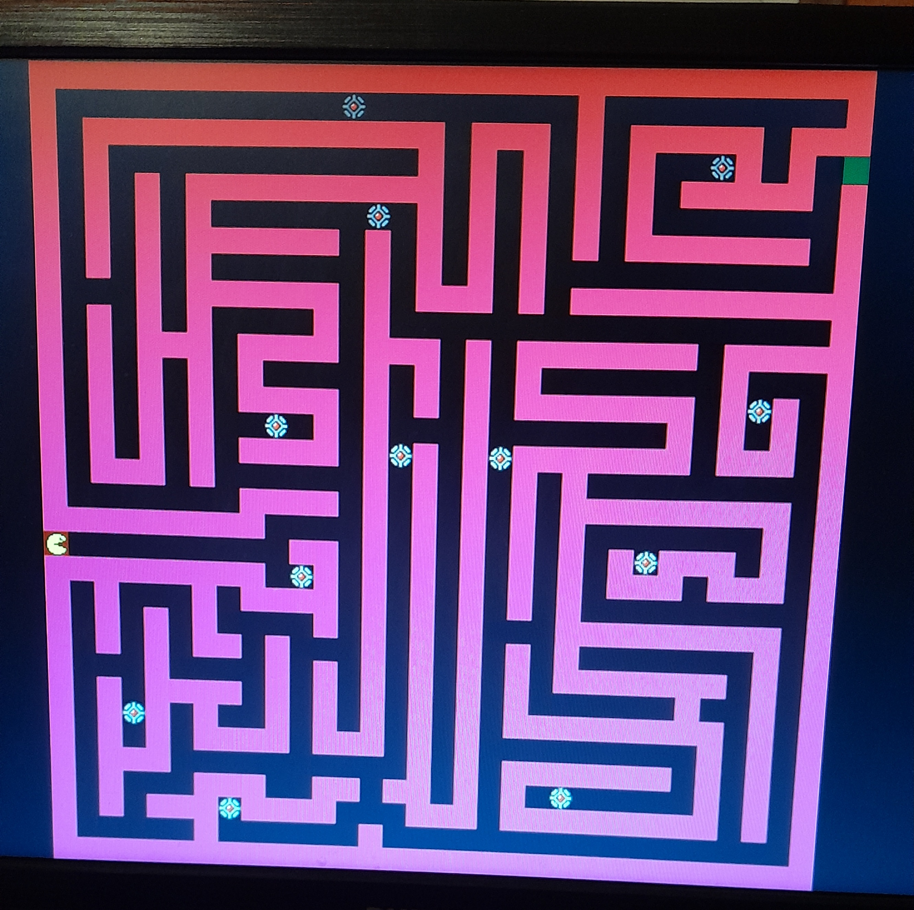
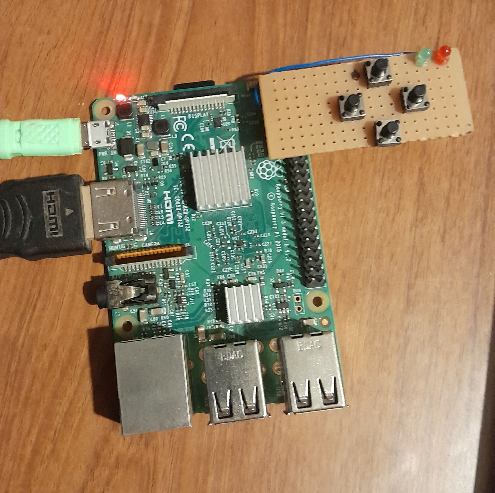
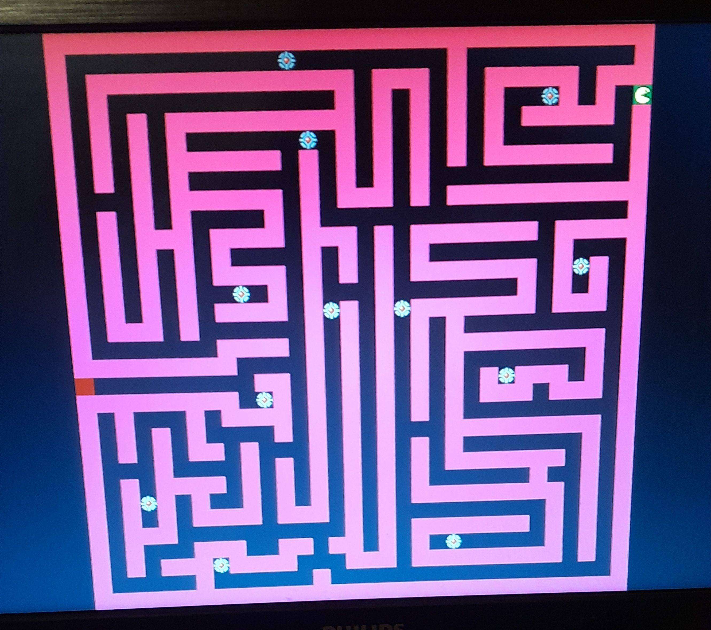
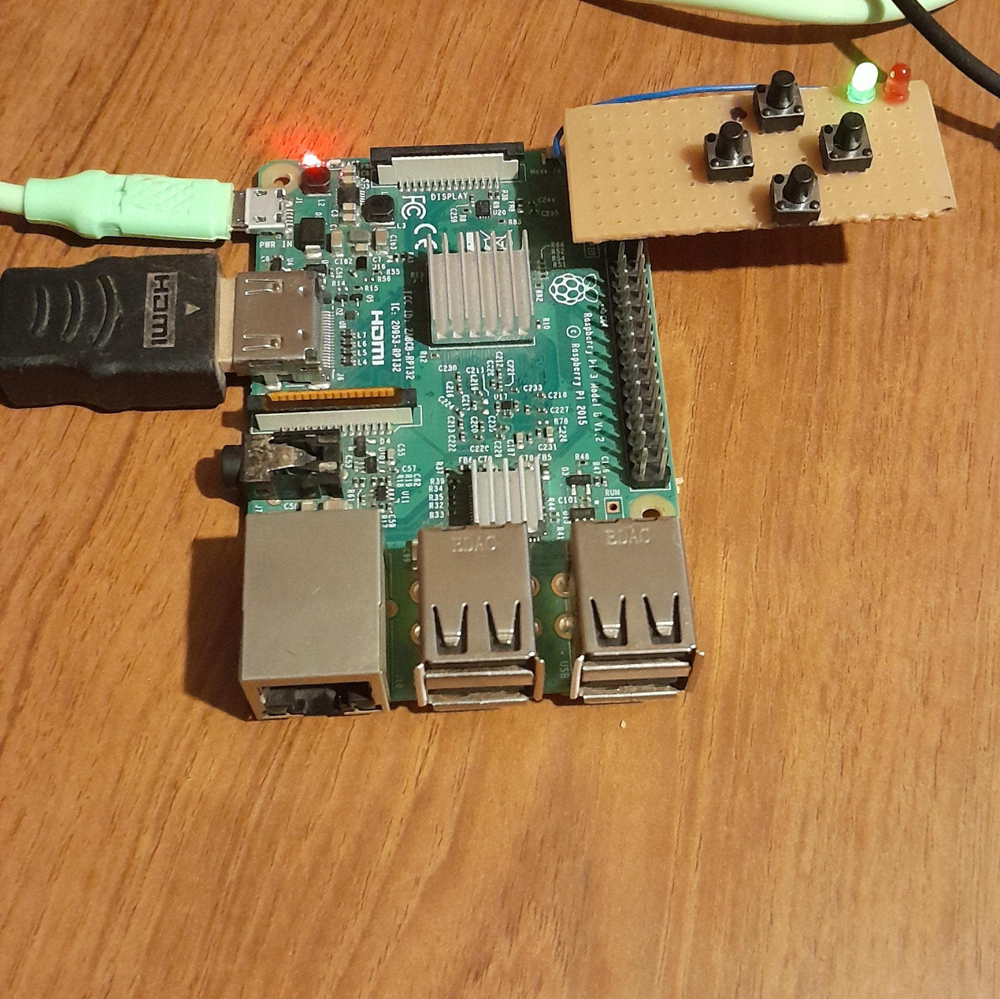
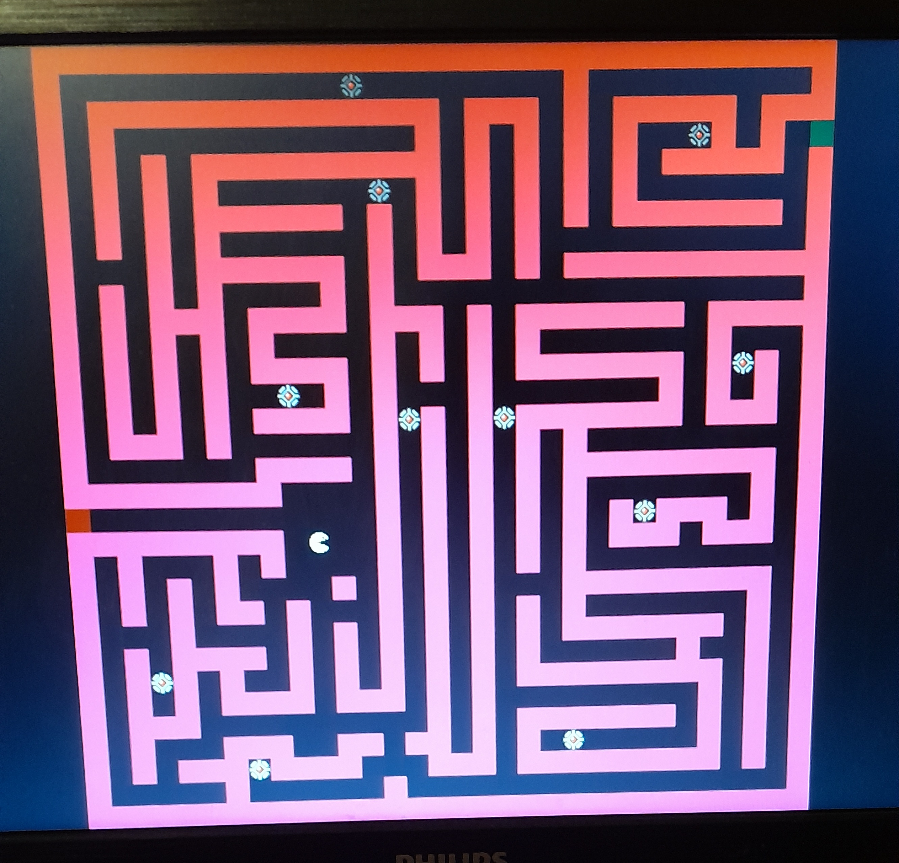
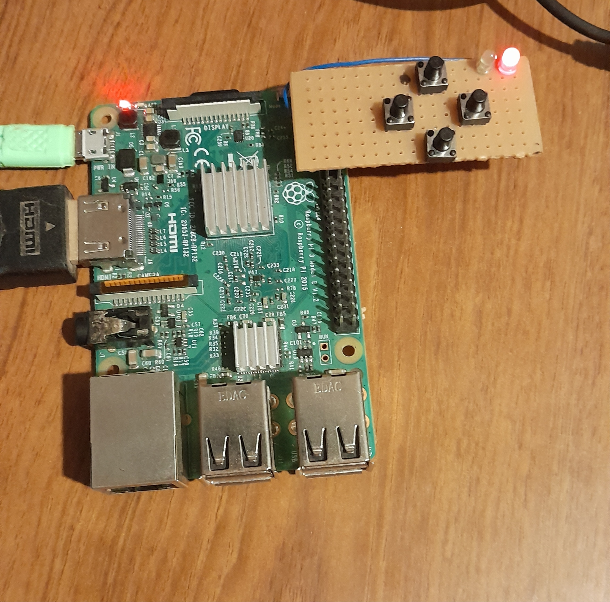

# Maze Game – Bare Metal Assembly on Raspberry Pi 3B+

This repository contains a low-level game project developed during the **sixth semester** of the **Systems Engineering** program at the **Catholic University of Córdoba**, for the course **Computer Architecture II**, taught by **Agustín Miguel Laprovitta**.

---

## 🧠 Project Description

The goal of this project was to design and program a maze-style game entirely in **pure Assembly**, running **bare-metal** on a **Raspberry Pi 3B+** — that is, **without an operating system**.

This project allowed me to work directly with the **kernel**, manage hardware-level input/output, and explore how software interacts closely with physical devices.

---

## 🕹️ How the Game Works

- The player navigates a maze with a goal to reach the **green tile** to win.
- If the player steps on a **mine**, the game ends in defeat.
- The game handles **input controls**, **state management**, and **visual transitions** between win/loss conditions entirely through Assembly code.

---

## 🖼️ Game States Overview

Here are screenshots of the different states of the game at both the **visual** and **control** levels.

### 🔵 Game Start

- **Start screen**: Visual layout before gameplay begins.
- **Control setup**: Button mappings and instructions.

| Screen | Controls |
|--------|----------|
|  |  |

---

### ✅ Victory Condition

- When the player reaches the **green tile**, the victory screen is displayed.

| Screen | Controls |
|--------|----------|
|  |  |

---

### ❌ Defeat Condition

- Stepping on a **mine** results in defeat.

| Screen | Controls |
|--------|----------|
|  |  |

---

## 💡 Key Learning Outcome

This project provided me with a deep understanding of **bare-metal programming**, **low-level hardware control**, and how to develop interactive software without relying on operating systems or high-level abstractions.

I also learned how to debug at the hardware level, structure an Assembly project, and manage device input/output directly via registers.

---

## ⚙️ Technologies Used

- **Assembly (ARMv8)**
- **Raspberry Pi 3B+**
- Bare-metal programming (no OS)
- Custom kernel logic

---
